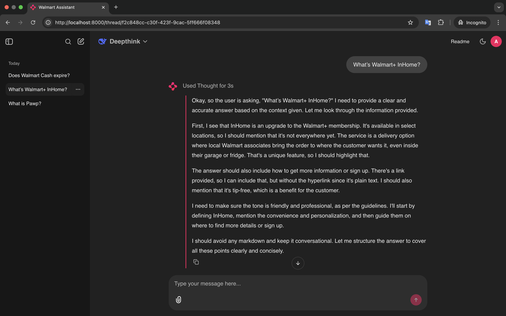

# RAG FAQ Chatbot (Production-Ready) 🚀

This repository contains a Retrieval-Augmented Generation (RAG) FAQ chatbot using Qdrant for vector search and Chainlit for the frontend.

## 🌟 Features
- 🗂 **Chat Profile**: Personalized user interactions.
- 🧠 **Chat Memory**: Stores past interactions for continuity.
- 💾 **Data Persistence**: Ensures long-term storage of chatbot data.
- 👍 **Human Feedback**: Allows users to provide feedback on chatbot responses.
- 🤔 **Thinking Step (Same as Deepseek-R1)**: Implements structured reasoning for responses.
- 🔐 **Authentication**: Secure user authentication for access control.

## 🔧 Technologies Used

- **Groq**: Utilized for running Large Language Models (LLMs) with high efficiency and speed.
- **Cohere**: Employed for generating text embedding services.
- **LlamaIndex**: Serves as the AI workflow backend.
- **Chainlit**: Provides the frontend framework for the chatbot.

## 📸 Thinking Process Screenshot

Below is a screenshot demonstrating the chatbot's reasoning process:



## 🚀 Deployment Instructions

### 1. Create AI Network
Before deploying, ensure you have the required Docker network:
```sh
docker network create --driver bridge ai
```

### 2. Deploy Services
To deploy the entire stack, run:
```sh
docker compose -p faq_chatbot up --build -d
```

To build and start specific services:
```sh
docker compose -p faq_chatbot up --build -d postgres prisma localstack ai-chatbot
```

## 📂 Project Structure
```
rag-faq-chatbot/
│── chainlit_app/   # Chainlit-based chatbot
│── documents/      # FAQ JSON documents
│── localstack/     # Localstack initialization
│── prisma/         # Prisma ORM setup
│── docker-compose.yml  # Docker configuration
│── embedding.ipynb  # Script for embedding documents into Qdrant
│── .env.example     # Example environment variables
```

## 🔗 Service Overview

| Service       | Port Mappings | Description |
|--------------|--------------|-------------|
| **Phoenix**  | 3000, 4317   | LLM tracing and monitoring |
| **Redis**    | 6379, 8001   | Redis database for storing chat history |
| **Qdrant**   | 6333, 6334   | Vector database for embeddings |
| **Postgres** | 5432         | SQL database for structured data |
| **Prisma**   | 5555         | Prisma ORM for database interactions |
| **Localstack** | 4566       | Mock AWS services |
| **Chainlit App** | 8000     | Chatbot UI & API |

## 📝 Post-Deployment Setup
After deploying the services, **run `embedding.ipynb`** to create the vector database in Qdrant from FAQ documents.

This script will:
- Parse JSON FAQs into documents
- Generate embeddings using Cohere API
- Store embeddings into Qdrant

After that, you can access the Chainlit app at:
**[http://localhost:8000/login](http://localhost:8000/login)**

## ⚙️ Environment Variables
Copy `.env.example` to `.env` and update the values before running the chatbot:
```sh
cp .env.example .env
```

## 🔧 Development & Debugging
To bring down the stack:
```sh
docker compose -p faq_chatbot down
```
To check logs for a specific service:
```sh
docker logs -f <container_name>
```