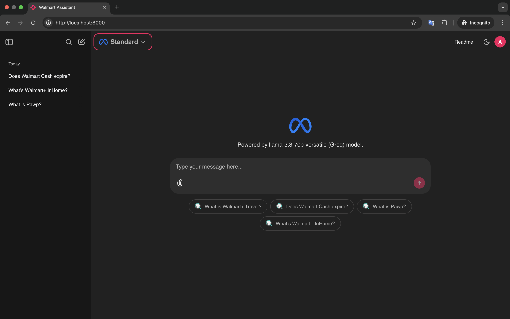

# Compliance Chatbot (Production-Ready) 🚀

This repository contains a sophisticated, production-ready Retrieval-Augmented Generation (RAG) chatbot designed for querying compliance documents. It is built with Chainlit, LlamaIndex, and a robust, containerized backend infrastructure.

## 🌟 Features

- **Advanced RAG Pipeline**: Implements a hybrid search (vector + keyword) and a clarification flow to handle ambiguous user queries effectively.
- **Multi-LLM & Embedding Support**: Easily configurable to use different Large Language Models (Groq, custom OpenAI-like APIs) and embedding services (Cohere, custom Text Embeddings Inference).
- **Chat Profiles**: Supports different chatbot personalities and configurations, like "Deepthink" for complex reasoning and "Accounting Compliance" for standard queries.
- **Persistent Data Layers**:
    - **Chat History**: Leverages Redis to maintain conversation context.
    - **Structured Data**: Uses PostgreSQL with Prisma for persisting user feedback, and conversation metadata.
- **LLM Observability**: Integrated with Phoenix for tracing and monitoring LLM operations.
- **User Authentication**: Secure access to the chatbot frontend via a credentials-based login.
- **Admin Reply**: A background process polls for and displays replies from administrators for specific conversations.
- **Predefined Answers**: Includes a set of hardcoded answers for common questions, matched using fuzzy string matching for quick responses.

## 🔧 Technology Stack

| Component | Technology | Purpose |
| :--- | :--- | :--- |
| **Application Framework** | Chainlit, LlamaIndex | UI, backend logic, and RAG orchestration. |
| **LLM Services** | Groq, OpenAILike | Generative AI for answering questions. |
| **Embedding Services** | Cohere, TextEmbeddingsInference | Vector embeddings generation. |
| **Vector Database** | Qdrant | Storage and retrieval of document embeddings. |
| **Chat Store / Cache** | Redis | Storing conversation history for memory. |
| **Relational Database** | PostgreSQL | Persistent storage for application data. |
| **ORM / Migrations** | Prisma | Database schema management and access. |
| **Observability** | OpenInference (Phoenix) | Tracing and monitoring LLM calls. |
| **Mock Cloud Services** | Localstack | Mock S3 for local development. |
| **Containerization** | Docker, Docker Compose | Packaging and running the application services. |

## 📸 Application Screenshots

**Thinking Process (Clarification Flow):**


**Main Chat Interface:**


## 🚀 Getting Started

### 1. Prerequisites
- Docker and Docker Compose
- An external Docker network named `ai`. If it doesn't exist, create it:
  ```sh
  docker network create --driver bridge ai
  ```

### 2. Configuration
The project uses environment files for configuration. There are two provided: `.env.dev` for local development and `.env.prod` for a production-like setup.

Create a `.env` file by copying one of the templates. This file will be automatically used by `docker-compose`.
```sh
# For development
cp .env.dev .env

# For production
cp .env.prod .env
```
Alternatively, you can specify the environment file directly in the `docker compose` command using the `--env-file` flag.

### 3. Deployment
Use Docker Compose to build and run the entire service stack. The `-p` flag sets the project name, which is important for managing containers and volumes.

**For Development:**
```sh
docker compose --env-file .env.dev -p compliance-chatbot up --build -d
```

**For Production:**
```sh
docker compose --env-file .env.prod -p compliance-chatbot up --build -d
```

### 4. Post-Deployment: Document Embedding
After all services are running, you must populate the Qdrant vector database with your compliance documents. This is a one-time setup step performed by running the `embedding-Compliance.ipynb` notebook.

This script will:
- Read documents from the `/documents` directory.
- Generate vector embeddings using the configured embedding service.
- Store the documents and their embeddings in the Qdrant collection.

### 5. Accessing the Application
Once the services are up and the embeddings are loaded, you can access the chatbot in your browser:

- **URL**: [http://localhost:8010/compliance-chat](http://localhost:8010/compliance-chat)
- **Login**: Use the default credentials `admin` / `admin` to log in.

## 🔗 Service Overview

The `docker-compose.yml` file exposes the following services and ports:

| Service | Host Port | Container Port | Description |
| :--- | :--- | :--- | :--- |
| **Chainlit App** | `8010` | `8010` | Chatbot UI & Backend |
| **Phoenix** | `3100` | `3000` | LLM Tracing & Monitoring UI |
| **Redis** | `6381` | `6379` | Redis database for chat history |
| **Qdrant** | `6433` | `6333` | Vector Database UI |
| **Qdrant (gRPC)** | `6434` | `6334` | Vector Database gRPC API |
| **Postgres** | `5434` | `5432` | SQL database for structured data |
| **Prisma Studio** | `5655` | `5555` | Web UI for managing Postgres data |
| **Localstack** | `4576` | `4566` | Mock AWS services (S3) |
| **Feedback API** | `4006` | `4001` | API for handling user feedback |


## 🔧 Development & Management

- **Stop all services:**
  ```sh
  docker compose -p compliance-chatbot down
  ```

- **View logs for a specific service:**
  ```sh
  docker logs -f <container_name>
  # e.g., docker logs -f compliance-app
  ```

- **Remove all data volumes (use with caution):**
  ```sh
  docker compose -p compliance-chatbot down -v
  ```
